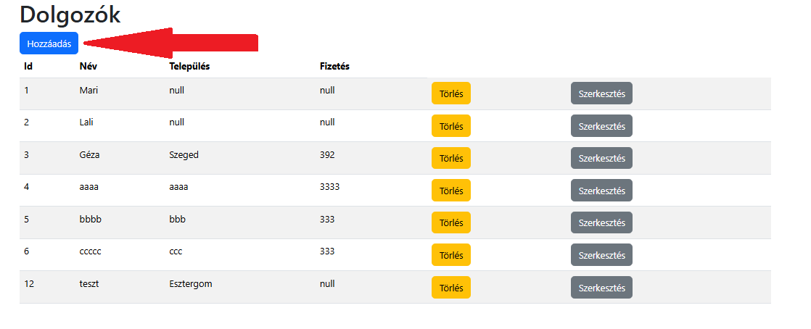

# Felhasználói dokumentáció

## Telepítés

Lépések:

* Letöltés
* Függőségek telepítése
* Backend indítása
* Frontend indítása

### Letöltés

Töltsük le a következő helyről: 

* https://github.com/suli2024/in_empke2

Például:

```bash
git clone https://github.com/suli2024/in_empke2
```


### Függőségek telepítése és indítás

Backend:

```bash
cd api
npm install
npm start
```

Frontend:

```bash
cd web
npm install
npm start
```

## Dolgozók kezelése

A főoldalon a dolgozók listáját láthatjuk.




Új dolgozó felvétele a táblázat felett a "Hozzáadás" gombra kattintva lehetséges.

A **dolgozók az azonosítójukat automatikusan** kapják, ezt _nem lehet megadni vagy szerkeszteni_.


A törlés a "Törlés" feliratú gombra kattintva kivitelezhető.


Egy dolgozó szerkesztése a "Szerkeszt" gombra kattintva kezdeményezhető, az adott sorban.


Szerkesztés után meg kell nyomni a "Mentés" gombot, hogy eltárolja az adatbázis az új adatokat.


